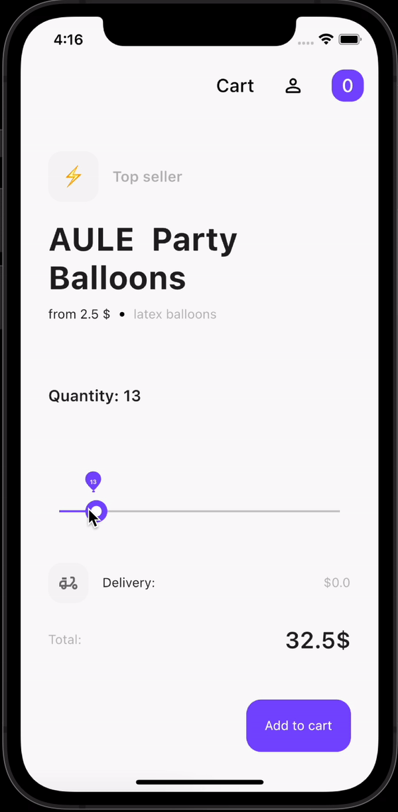
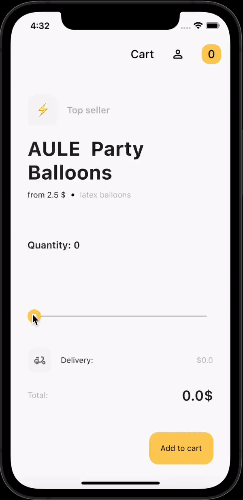

# Flutter Balloon Slider

A Flutter plugin to create range slider with balloon animation effect.

Inspired by [Cuberto - Balloon Slider](https://dribbble.com/shots/6549207-Balloon-Slider-Control)

[](https://pub.dartlang.org/packages/balloon_slider)
[](https://github.com/himym1989/baloon-slider-flutter)
[](https://opensource.org/licenses/MIT)

 &nbsp; 

* Add this to your pubspec.yaml
  ```
  dependencies:
  balloon_slider: ^1.0.0
  ```
* Get the package from Pub:
  ```
  flutter packages get
  ```
* Import it in your file
  ```
  import 'package:balloon_slider/balloon_slider.dart';
  ```

## Usage

``` dart
BalloonSlider(
  balloonTextStyle: const TextStyle(
    color: Colors.black,
    fontSize: 18,
    fontWeight: FontWeight.w600,
  ),
  value: sliderValue,
  color: Colors.yellow,
),
```

## Credits

 * [Cuberto - Balloon Slider](https://dribbble.com/shots/6549207-Balloon-Slider-Control)

## Maintainers
 
 * [Olena Zhukova](https://github.com/himym1989)
 
## License

 [](https://opensource.org/licenses/MIT)
